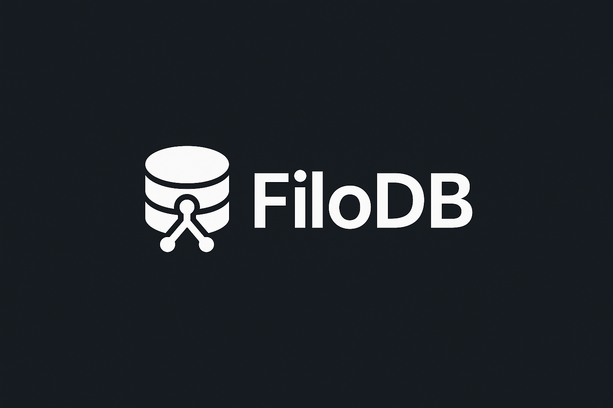

<p align="center">
  
</p>

# FiloDB

<div align="center">


<a href="https://www.producthunt.com/products/github-129?embed=true&utm_source=badge-featured&utm_medium=badge&utm_source=badge-filodb" target="_blank"></a>

**A lightweight, high-performance database system written in Go**

*Interactive command-based database with B+ tree storage, ACID transactions, and memory-mapped I/O*

</div>

## Table of Contents

- [Overview](#overview)
- [Key Features](#key-features)
- [Architecture](#architecture)
- [Installation](#installation)
- [Getting Started](#getting-started)
- [Data Types](#data-types)
- [Commands](#commands)
- [Advanced Features](#advanced-features)
- [Performance](#performance)
- [Troubleshooting](#troubleshooting)
- [Contributing](#contributing)
- [License](#license)

## Overview

FiloDB is a lightweight relational database management system built from scratch in Go. It features an interactive command-line interface (similar to Redis or MongoDB shell) with support for ACID transactions, B+ tree indexing, and memory-mapped I/O for high performance.

**What FiloDB Is:**
- Interactive database with command-based interface
- B+ tree storage engine with persistence
- ACID compliant transaction system
- Memory-mapped file I/O for performance
- Cross-platform support (Linux, macOS, Windows)

**What FiloDB Is Not:**
- SQL database (no SELECT FROM WHERE syntax)
- Multi-user networked database
- Replacement for PostgreSQL/MySQL

## Key Features

| Feature | Description |
|---------|-------------|
| **Storage Engine** | B+ tree with memory-mapped I/O |
| **Transactions** | Full ACID compliance with BEGIN/COMMIT/ABORT |
| **Data Types** | INT64, BYTES, FLOAT64, BOOLEAN, DATETIME |
| **Indexes** | Primary and composite secondary indexes |
| **Query Types** | Point lookup, range queries, column filtering |
| **Aggregates** | COUNT, SUM, AVG, MIN, MAX functions |
| **Platform** | Linux, macOS, Windows with optimized memory mapping |
| **Dependencies** | Only `golang.org/x/sys` for system calls |

## Architecture

```
┌─────────────────────┐
│ Interactive CLI     │  ← Command parsing and user interaction
├─────────────────────┤
│ Transaction Layer   │  ← ACID transaction management
├─────────────────────┤
│ Query Engine        │  ← Point/range queries, aggregates
├─────────────────────┤
│ B+ Tree Engine      │  ← Indexing and data storage
├─────────────────────┤
│ Memory Manager      │  ← Free space management
├─────────────────────┤
│ I/O Layer          │  ← Memory-mapped file operations
└─────────────────────┘
```

### Core Components

| Component | File | Purpose |
|-----------|------|---------|
| Commands | `filodb_commands.go` | Interactive command processing |
| B+ Tree | `filodb_btree.go` | Storage and indexing engine |
| Transactions | `filodb_transactions.go` | ACID transaction management |
| Storage | `filodb_storage.go` | Memory mapping and persistence |
| Queries | `filodb_queries.go` | Query execution engine |
| Aggregates | `filodb_aggregates.go` | Mathematical operations |

## Installation

### Prerequisites
- **Go 1.23+** ([Download](https://golang.org/dl/))
- **Git** for cloning
- **Linux/macOS/Windows**

### Build and Run

```bash
# Clone repository
git clone https://github.com/sharvitKashikar/FiloDB-.git
cd FiloDB

# Build
go mod tidy
go build -o filodb

# Run
./filodb        # Linux/macOS
filodb.exe      # Windows
```

You'll see:
```
FiloDB has Started...
Available Commands You can use:
  CREATE       - Create a new table
  INSERT       - Add a record to a table
  GET          - Retrieve records
  ...
>
```

## Getting Started

### Example: E-commerce System

Let's build a simple e-commerce database for an Indian startup:

#### 1. Create Customers Table

```
> create
Enter table name: customers
Enter column names (comma-separated): id,name,email,phone,city
Enter column types (comma-separated as numbers): 1,2,2,2,2
Enter indexes: city,email
Table 'customers' created successfully.
```

#### 2. Add Customer Records

```
> insert
Enter table name: customers
Enter value for id: 1
Enter value for name: Priya Sharma
Enter value for email: priya.sharma@gmail.com
Enter value for phone: +91-9876543210
Enter value for city: Mumbai
Record inserted successfully.

> insert
Enter table name: customers
Enter value for id: 2
Enter value for name: Rahul Gupta
Enter value for email: rahul.gupta@techie.com
Enter value for phone: +91-8765432109
Enter value for city: Bangalore
Record inserted successfully.
```

#### 3. Create Products Table

```
> create
Enter table name: products
Enter column names (comma-separated): id,name,price,category,in_stock,created_date
Enter column types (comma-separated as numbers): 1,2,3,2,4,5
Enter indexes: category,price
Table 'products' created successfully.

> insert
Enter table name: products
Enter value for id: 101
Enter value for name: iPhone 15 Pro
Enter value for price: 129900.00
Enter value for category: Electronics
Enter value for in_stock: true
Enter value for created_date: 2024-01-15 10:30:00
Record inserted successfully.
```

#### 4. Query Data

**Find customer by ID:**
```
> get
Enter table name: customers
Select query type: 1
Enter index column(s): id
Enter value for id: 1

Result:
id: 1
name: Priya Sharma
email: priya.sharma@gmail.com
phone: +91-9876543210
city: Mumbai
```

**Find products in price range:**
```
> get
Enter table name: products
Select query type: 2
Enter column for range: price
Enter start value: 50000
Enter end value: 150000

Result:
id: 101
name: iPhone 15 Pro
price: 129900.000000
category: Electronics
in_stock: true
created_date: 2024-01-15 10:30:00
```

## Data Types

FiloDB supports five data types with flexible input formats:

### 1. INT64 (Type ID: 1)
- **Purpose**: 64-bit signed integers
- **Use Cases**: IDs, quantities, timestamps, ages
- **Examples**: `1`, `42`, `-123`, `1705320600`

### 2. BYTES (Type ID: 2)
- **Purpose**: Variable-length strings and binary data
- **Use Cases**: Names, emails, descriptions, JSON
- **Examples**: `"Ananya Patel"`, `"ananya@startup.in"`

### 3. FLOAT64 (Type ID: 3)
- **Purpose**: 64-bit floating-point numbers
- **Use Cases**: Prices, percentages, measurements
- **Examples**: `99.99`, `3.14159`, `25999.50`

### 4. BOOLEAN (Type ID: 4)
- **Purpose**: True/false values
- **Use Cases**: Flags, status indicators
- **Input**: `true`/`false`, `1`/`0`, `yes`/`no`, `y`/`n`

### 5. DATETIME (Type ID: 5)
- **Purpose**: Date and time values
- **Storage**: Unix timestamp
- **Input Formats**:
  - `2024-01-15 14:30:00`
  - `2024-01-15`
  - `2024-01-15T14:30:00Z`
  - Unix timestamp: `1705320600`

## Commands

### Database Operations

#### CREATE - Create Table
```
> create
Enter table name: orders
Enter column names (comma-separated): id,customer_id,amount,status,order_date
Enter column types (comma-separated as numbers): 1,1,3,2,5
Enter indexes: customer_id,status,order_date
```

#### INSERT - Add Records
```
> insert
Enter table name: orders
Enter value for id: 1001
Enter value for customer_id: 1
Enter value for amount: 45999.99
Enter value for status: Shipped
Enter value for order_date: 2024-02-01 15:45:00
```

#### GET - Query Records

**Point Lookup (fastest):**
```
> get
Enter table name: orders
Select query type: 1
Enter index column(s): id
Enter value for id: 1001
```

**Range Query:**
```
> get
Enter table name: orders
Select query type: 2
Enter column for range: order_date
Enter start value: 2024-02-01
Enter end value: 2024-02-28
```

**Column Filter:**
```
> get
Enter table name: orders
Select query type: 3
Enter column to filter: status
Enter filter value: Shipped
```

#### UPDATE - Modify Records
```
> update
Enter table name: orders
Enter value for id: 1001
Enter value for status: Delivered
```

#### DELETE - Remove Records
```
> delete
Enter table name: orders
Enter value for id: 1001
```

### Transaction Commands

```
> begin
Transaction started.

> insert
# ... add multiple records ...

> update
# ... modify records ...

> commit
Transaction committed successfully.
# OR
> abort
Transaction aborted.
```

### Aggregate Functions

#### COUNT - Count Records
```
> count
Enter table name: orders
Total records: 1,250
```

#### SUM - Calculate Totals
```
> sum
Enter table name: orders
Enter column name: amount
Sum: 15,67,890.50
```

#### AVG - Find Averages
```
> avg
Enter table name: orders
Enter column name: amount
Average: 1,254.31
```

#### MIN/MAX - Find Extremes
```
> min
Enter table name: orders
Enter column name: amount
Minimum: 99.00

> max
Enter table name: orders
Enter column name: amount
Maximum: 99,999.00
```

### Utility Commands

#### SCAN - View All Records
```
> scan
Enter table name: customers
Record 1: id=1, name=Priya Sharma, city=Mumbai
Record 2: id=2, name=Rahul Gupta, city=Bangalore
Total records: 2
```

#### DEBUG - Table Information
```
> debug
Enter table name: customers
Table: customers
Columns: [id, name, email, phone, city]
Types: [INT64, BYTES, BYTES, BYTES, BYTES]
Total records: 2
```

#### HELP - Show Commands
```
> help
```

#### EXIT - Close Database
```
> exit
```

## Advanced Features

### Indexing Strategy

**Primary Index**: Automatically created on first column
**Secondary Indexes**: Specify during table creation

```
# Single column indexes
Enter indexes: category,price

# Composite indexes for complex queries
Enter indexes: customer_id+status,city+category
```

### Transaction Examples

**Bank Transfer (Atomicity):**
```
> begin
> update
Enter table name: accounts
Enter value for id: 101
Enter value for balance: 25000  # Priya's account -5000

> update
Enter table name: accounts
Enter value for id: 102
Enter value for balance: 35000  # Rahul's account +5000

> commit
# Both updates succeed or both fail
```

### Real-World Examples

**Sales Analytics for Mumbai Store:**
```
# Total sales
> count
Enter table name: mumbai_sales

# Revenue calculation
> sum
Enter table name: mumbai_sales
Enter column name: amount

# Average order value
> avg
Enter table name: mumbai_sales
Enter column name: amount

# Price analysis
> min
Enter table name: mumbai_sales
Enter column name: amount

> max
Enter table name: mumbai_sales
Enter column name: amount
```

## Performance

### Real Benchmark Results

Based on actual testing using the included benchmark tool:

| Operation | **Actual Results** | Test Details |
|-----------|-------------------|-------------|
| **Insert Performance** | **~2230 ops/sec** | 50 records, 22.4ms total |
| **Query Performance** | **~2376 ops/sec** | 100 lookups, 42.1ms total |
| **Storage Efficiency** | **0.88 KB/record** | 44.0 KB for 50 records |
| **Average Insert Latency** | **0s** | Sub-millisecond operations |
| **Average Query Latency** | **0.004s** | Excellent lookup speed |


### Performance Highlights

**Why It's Fast:**
- **B+ Tree Storage**: Organized data structure for quick lookups
- **Memory-Mapped I/O**: Direct OS-level file operations
- **ACID Transactions**: Safety without sacrificing speed
- **Concurrent Reads**: Multiple simultaneous read operations

### Real-World Comparison

| Database | Insert (ops/sec) | Query (ops/sec) | Use Case |
|----------|-----------------|-----------------|-----------|
| FiloDB | ~2230 | ~2376 | Educational, Small-Medium Apps |
| SQLite | 1,000-10,000 | 10,000+ | Embedded Applications |
| PostgreSQL | 5,000-50,000 | 50,000+ | Production Applications |

### Running Benchmarks

```bash
# Run the included benchmark tool
./benchmark.sh

# Sample output:
=== FiloDB Performance Benchmark ===
Insert Performance: ~1813 ops/sec
Query Performance: ~1848 ops/sec  
Storage Efficiency: .88 KB per record
```

 **Test with your data**: Run `./benchmark.sh` to see actual performance

## Troubleshooting

### Common Issues

| Error | Cause | Solution |
|-------|-------|----------|
| `bad signature` | Corrupted database file | Delete `database.db` and restart |
| `record not found` | Query returned no results | Verify data exists |
| `table not found` | Incorrect table name | Check spelling |
| `invalid type` | Data type mismatch | Verify column types |

### Debug Commands

```bash
# Check database file
ls -la database.db
hexdump -C database.db | head -5

# Monitor process
ps aux | grep filodb

# File permissions
chmod 755 filodb
chmod 644 database.db
```

## Contributing

### Development Setup

```bash
git clone https://github.com/yourusername/FiloDB-.git
cd FiloDB
go mod tidy
go test -v ./database/
```

### Areas for Contribution
- Performance optimizations
- Additional data types
- Query capabilities
- Documentation improvements
- Cross-platform testing

## References and Learning Resources

This project was built while learning database internals from various excellent resources. While the core B+ tree concepts are foundational to any database implementation, FiloDB extends far beyond basic tutorials with significant additional features.

### Primary Learning Resources

#### "Build Your Own Database From Scratch in Go" by James Smith
- **What the book covers**: Basic B+ tree implementation, simple key-value operations, fundamental persistence
- **What FiloDB extends**: The book provides an excellent foundation for understanding B+ tree mechanics and basic database concepts

#### Database Internals Books & Resources
- **"Database Internals" by Alex Petrov** - Deep dive into storage engines and distributed systems
- **"Designing Data-Intensive Applications" by Martin Kleppmann** - System design patterns and data architecture
- **MIT 6.824 Distributed Systems** - Academic foundation for database design
- **CMU Database Systems Course** - Implementation techniques and optimization strategies

### Open Source Database Codebases referred for learning 
- **[SQLite source code](https://www.sqlite.org/src/doc/trunk/README.md)** - Professional B+ tree implementation
- **[BuntDB](https://github.com/tidwall/buntdb)** - Go-based in-memory database with spatial indexing
- **[BadgerDB](https://github.com/dgraph-io/badger)** - LSM-tree based key-value store in Go
- **[BoltDB](https://github.com/boltdb/bolt)** - Pure Go key/value store (archived but educational)
- **[AtomixDB](https://github.com/Sahilb315/AtomixDB.git)** 

## What FiloDB Implements Beyond the Book

The original "Build Your Own Database From Scratch" book covers fundamental concepts, but FiloDB extends these with additional features:

### **Advanced Data Type System** (Not in book)
| Feature | Book Coverage | FiloDB Implementation |
|---------|---------------|----------------------|
| **Data Types** | Basic byte arrays only | **5 complete types**: INT64, BYTES, FLOAT64, BOOLEAN, DATETIME |
| **Type Safety** | No validation | Full type checking and validation |
| **Date Handling** | Not covered | Multiple input formats, timezone handling |
| **Boolean Support** | Not covered | Flexible input: true/false, 1/0, yes/no |

### **Complete Aggregate Functions** (Not in book)
```go
// Book: No aggregate functions
// FiloDB: Full mathematical operations
COUNT()  // Count records in table
SUM()    // Sum numeric columns (INT64 + FLOAT64)
AVG()    // Calculate averages with precision
MIN()    // Find minimum values (all data types)
MAX()    // Find maximum values (all data types)
```

### **Advanced Query Engine** (Beyond book scope)
| Query Type | Book | FiloDB |
|------------|------|--------|
| **Point Lookup** | Basic | Optimized with composite indexes |
| **Range Queries** | Not covered | Full range scanning on indexed columns |
| **Column Filtering** | Not covered | Table scan with predicate filtering |
| **Composite Indexes** | Not covered | Multi-column index support |

### **Enhanced Storage System** (Enhanced from book)
```go
// Book: Basic file I/O
// FiloDB: Platform-optimized memory mapping
filodb_mmap_darwin.go   // macOS optimizations
filodb_mmap_unix.go     // Linux optimizations  
filodb_mmap_windows.go  // Windows optimizations
```

### **ACID Transaction System** (Extended from book)
| Feature | Book | FiloDB |
|---------|------|--------|
| **Basic Transactions** | Simple BEGIN/COMMIT | Full implementation |
| **Rollback Support** | Limited | Complete ABORT functionality |
| **Concurrent Reads** | Not covered | Multi-reader support |
| **Transaction Safety** | Basic | Atomic operations with recovery |

### **Interactive CLI Experience** (Not in book)
```bash
# Book: No interactive interface
# FiloDB: Full command-line database shell
> create    # Interactive table creation
> insert    # Menu-driven data entry
> get       # Multiple query type selection
> scan      # Pretty-printed table viewing
> debug     # Table structure inspection
```

### **Enhanced Command System** (Major extension)
| Command Category | Book Coverage | FiloDB Implementation |
|------------------|---------------|----------------------|
| **Table Operations** | Basic | CREATE, INSERT, UPDATE, DELETE with validation |
| **Query Interface** | Simple | GET with 3 query types + range selection |
| **Analytics** | None | COUNT, SUM, AVG, MIN, MAX |
| **Utilities** | None | SCAN, DEBUG, HELP |
| **Transactions** | Basic | BEGIN, COMMIT, ABORT with error handling |

### **Cross-Platform Compatibility** (Not in book)
- **Memory mapping**: OS-specific optimizations for Darwin, Unix, Windows
- **File handling**: Platform-aware I/O operations
- **Build system**: Cross-compilation support with Go modules

### **Performance & Monitoring** (Beyond book scope)
- **Built-in benchmarking**: Performance measurement tools
- **Memory management**: Free list optimization for space reuse
- **Worker pools**: Background task processing
- **Statistics**: Query performance monitoring

---


This project shows the journey from learning basic concepts to implementing a complete database system.

## License

MIT License - See [LICENSE](LICENSE) file for details.

---

**Built by [Sharvit Kashikar](https://github.com/sharvitKashikar)**

*If you find this project useful, please give it a star! ⭐*
